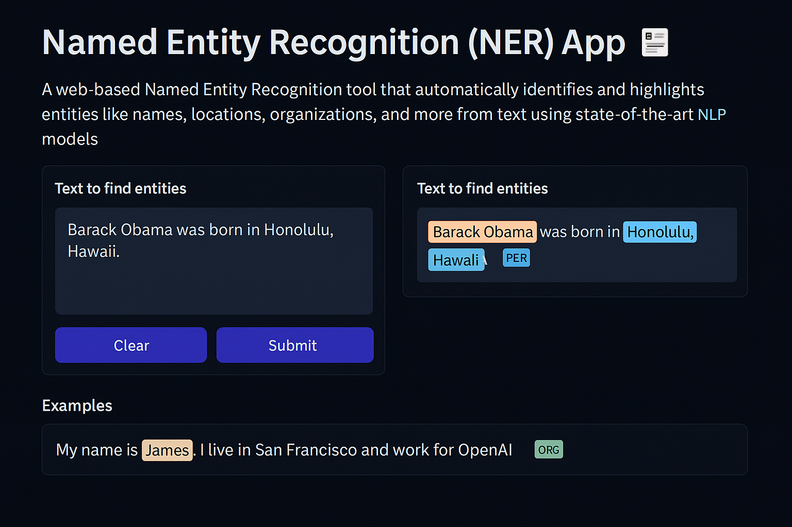

# Named Entity Recognition (NER) App 🏷️

A web-based Named Entity Recognition tool that automatically identifies and highlights entities like names, locations, organizations, and more from text using state-of-the-art NLP models. Built with Gradio and deployed on Hugging Face Spaces.



## 🚀 Live Demo

Try the app: [Named-Entity-Recognition](https://huggingface.co/spaces/ashish-soni08/Named-Entity-Recognition)

## ✨ Features

- **Automatic Entity Detection**: Instantly identify persons, locations, organizations, and miscellaneous entities
- **Visual Highlighting**: Entities are color-coded and highlighted for easy identification
- **Real-time Processing**: Get results in seconds with pre-trained BERT model
- **Clean Interface**: Intuitive web UI built with Gradio
- **Mobile Responsive**: Works seamlessly on desktop and mobile devices

## 🛠️ Technology Stack

- **Backend**: Python, Hugging Face Transformers
- **Frontend**: Gradio
- **Model**: [dslim/bert-base-NER](https://huggingface.co/dslim/bert-base-NER)
- **Deployment**: Hugging Face Spaces

## 🏃‍♂️ Quick Start

### Prerequisites

```bash
Python 3.8+
pip
```

### Installation

1. Clone the repository:
```bash
git clone https://github.com/Ashish-Soni08/named-entity-recognition-app.git
cd ner-app
```

2. Install dependencies:
```bash
pip install -r requirements.txt
```

3. Run the application:
```bash
python app.py
```

4. Open your browser and navigate to `http://localhost:7860`

## 📋 Usage

1. **Input Text**: Enter or paste the text you want to analyze in the "Text to find entities" box
2. **Process**: Click the "Submit" button to perform Named Entity Recognition
3. **View Results**: Identified entities will be highlighted with different colors based on their type

### Entity Types Detected

- **PER** (Person): Names of people
- **LOC** (Location): Geographic locations, cities, countries
- **ORG** (Organization): Companies, institutions, organizations
- **MISC** (Miscellaneous): Other named entities

### Example

**Input:**
```
Apple Inc. is headquartered in Cupertino, California. Tim Cook is the current CEO of the company.
```

**Output:**
```
[Apple Inc.](ORG) is headquartered in [Cupertino](LOC), [California](LOC). [Tim Cook](PER) is the current CEO of the company.
```

## 🧠 Model Information

This app uses **dslim/bert-base-NER**, a fine-tuned BERT model for Named Entity Recognition:

- **Architecture**: BERT-base
- **Parameters**: ~110 million parameters
- **Entity Types**: Person (PER), Location (LOC), Organization (ORG), Miscellaneous (MISC)
- **Performance**: F1-score of ~91%

## 📁 Project Structure

```
ner-app/
├── app.py                 # Main Gradio application
├── requirements.txt       # Python dependencies
├── README.md             # Project documentation
```

## 📄 License

This project is licensed under the Apache License 2.0

## 🙏 Acknowledgments

- [Hugging Face](https://huggingface.co/) for the Transformers library and model hosting
- [Gradio](https://gradio.app/) for the web interface framework
- [dslim](https://huggingface.co/dslim) for the fine-tuned BERT-NER model

## 📞 Contact

Ashish Soni - ashish.soni2091@gmail.com

Project Link: [github](https://github.com/Ashish-Soni08/ner-app)
